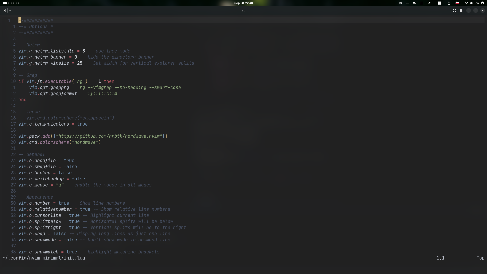

<div align="center">

# Nord Wave

<br/>
<br/>



<br/>
<br/>

</div>

## Requirements

- Neovim 0.10+
- `termguicolors` (enabled automatically by the colorscheme)

## Installation

1. Using `Lazy`:

```lua
{ 'hrbtk/nordwave.nvim' },
```

2. Using `Packer`:

```lua
use 'hrbtk/nordwave.nvim'
```

3. Using `vim.pack()`:

```lua
vim.pack.add({ "https://github.com/hrbtk/nordwave.nvim" })
```

## Usage

```lua
vim.cmd.colorscheme('nordwave')
```

Nord Wave is a dark colorscheme: `nordwave` and `nordwave-dark` both set `background=dark`. A light variant is not available yet.

`require('nordwave').colorscheme()` applies the colors without changing `background`.

## Configuration

To configure the plugin, call `require('nordwave').setup({})` **before** applying the colorscheme. Options you pass are merged with the defaults, so you only need to specify what you want to change. The following are the **defaults**:

```lua
require('nordwave').setup({
    transparent = false, -- Boolean: Sets the background to transparent
    italics = {
        comments = true, -- Boolean: Italicizes comments
        keywords = true, -- Boolean: Italicizes keywords
        functions = true, -- Boolean: Italicizes functions
        strings = true, -- Boolean: Italicizes strings
        variables = true, -- Boolean: Italicizes variables
        bufferline = false, -- Boolean: Italicizes some bufferline.nvim elements
    },
    overrides = {}, -- A dictionary of group names, can be a function returning a dictionary or a table.
})
```

Example of `overrides`:

```lua
require('nordwave').setup({
    overrides = {
        Comment = { fg = '#7a808c', italic = true },
        ['@variable'] = { link = 'Identifier' },
    },
})
```

### Specifics for Some Plugins

#### lualine.nvim

A [lualine.nvim](https://github.com/nvim-lualine/lualine.nvim) theme is included. It is picked up automatically with `theme = 'auto'`, or can be set explicitly:

```lua
require('lualine').setup({
    options = { theme = 'nordwave' },
})
```

#### Bufferline.nvim

To use the theme with [bufferline.nvim](https://github.com/akinsho/bufferline.nvim), you can use the following configuration:

```lua
require('bufferline').setup({
    highlights = require('nordwave').bufferline.highlights,
})
```

#### nvim-cmp

[nvim-cmp](https://github.com/hrsh7th/nvim-cmp) highlight groups are applied automatically.

## Credits

Built on top of [nvim-colorscheme-template](https://github.com/datsfilipe/nvim-colorscheme-template) from [datsfilipe](https://github.com/datsfilipe).
Inspired by [Nord Wave](https://term.const.net/en/themes/nord-wave/) colorscheme.

## License

[MIT License](LICENSE)
